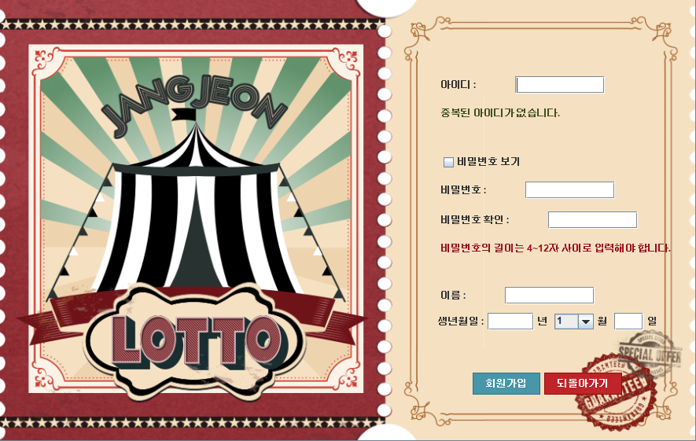
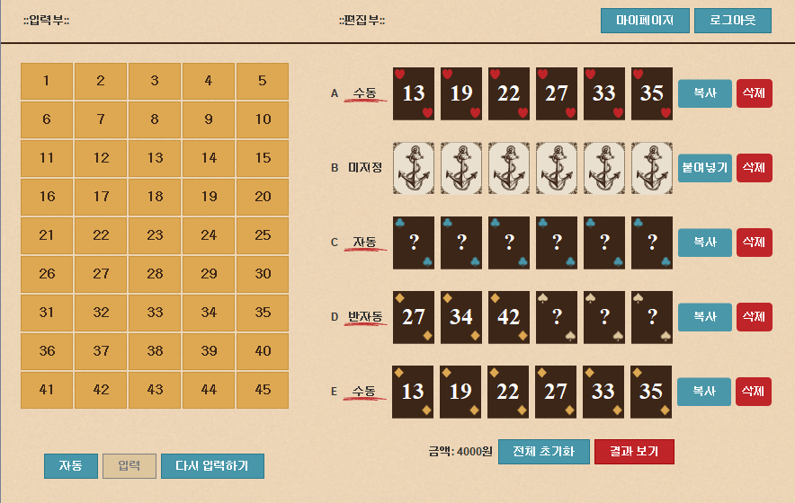
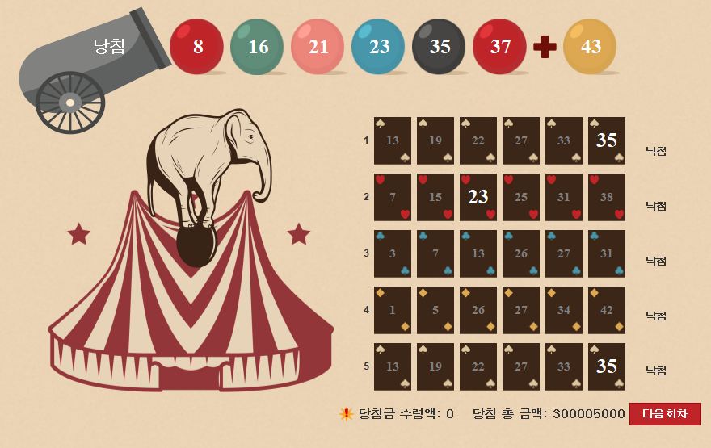

# JangJeon Lotto
로또 게임. 당신의 운을 시험해 보세요 !
***
### 1. 프로젝트 정보
  로또를 가상으로 구매해보고 그 결과를 볼 수 있는 프로그램입니다.   
  동행복권(https://dhlottery.co.kr/common.do?method=main) 의 구입안내를 참조하여 제작하였습니다.
  
  - 사용기술
    - JAVA 8

  - 특징
    - 가변적인 로또 구매 갯수 
    - 수동 , 반자동, 자동 총 세가지 방식의 구매 옵션 제공
    - JAVA -SWING만을 이용하여 간편한 실행과 사용 가능
 
- 제작기간
  - 2022.06.25 ~ 2022.07.01

- 담당업무와 기여도
  - 팀원들의 코드 취합, 로또 구매 페이지 로직 작성
  - 기여도: 50%

***

### 2. 프로그램 설치와 구동

첨부된 JangJeonLotto_1.0v.jar 파일을 더블클릭하여 실행합니다.   
JDK 혹은 JRE 설치가 선행되어야 합니다.   
  설치하러 가기 -> https://www.oracle.com/java/technologies/downloads/   
   
JongJeonLotto 폴더 안에 소스코드가 존재합니다.

***

## 3. 프로그램 미리보기
- 회원가입 페이지   
   
- 구매 페이지   
   
- 결과 출력 페이지   
   

***

## 4. LICENSE
- (C) 2014. JeonInha all rights reserved.
- 해당 프로그램에 사용된 디자인 요소들은 미리캔버스(https://www.miricanvas.com/) 를 통해 제작하였습니다.

